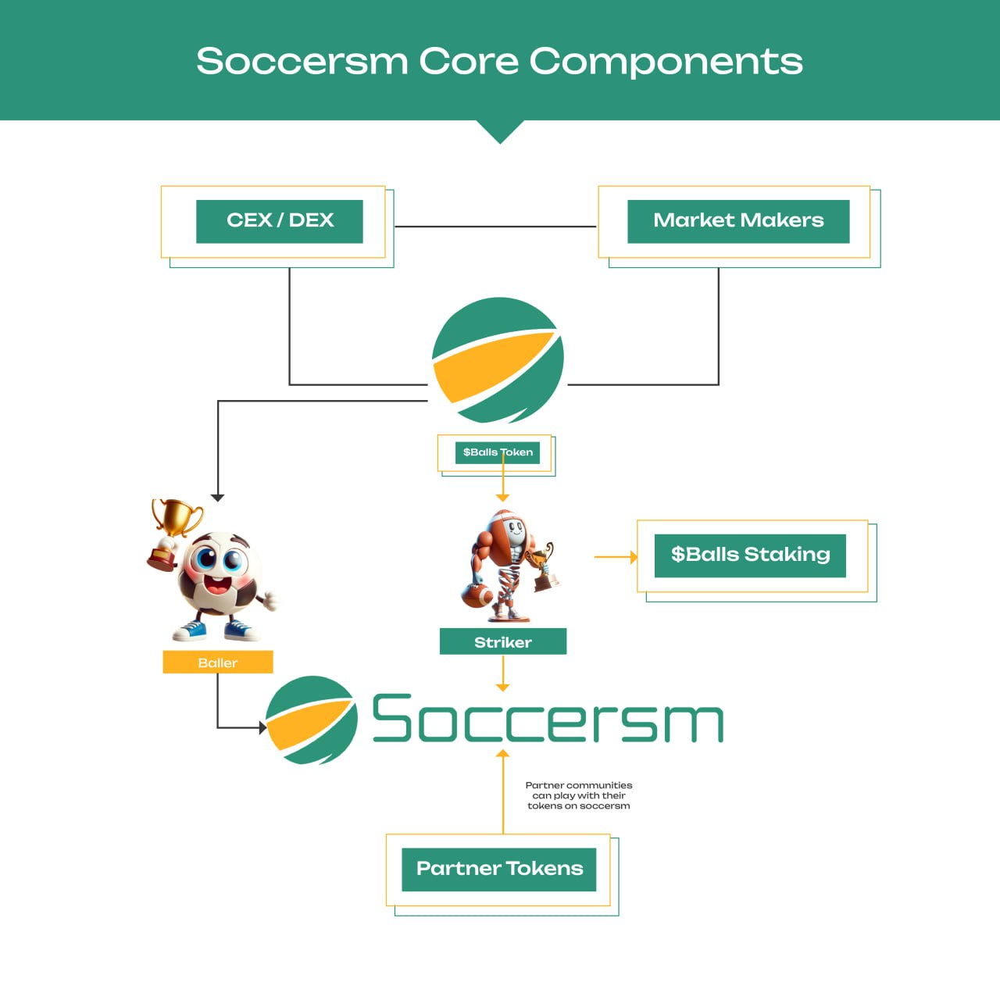
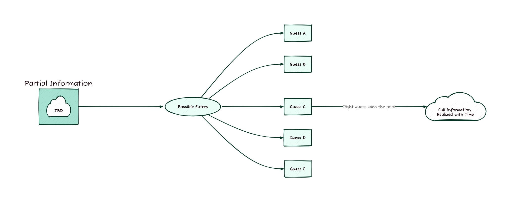
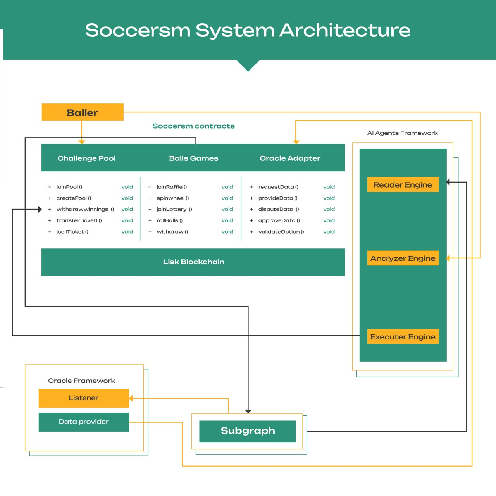
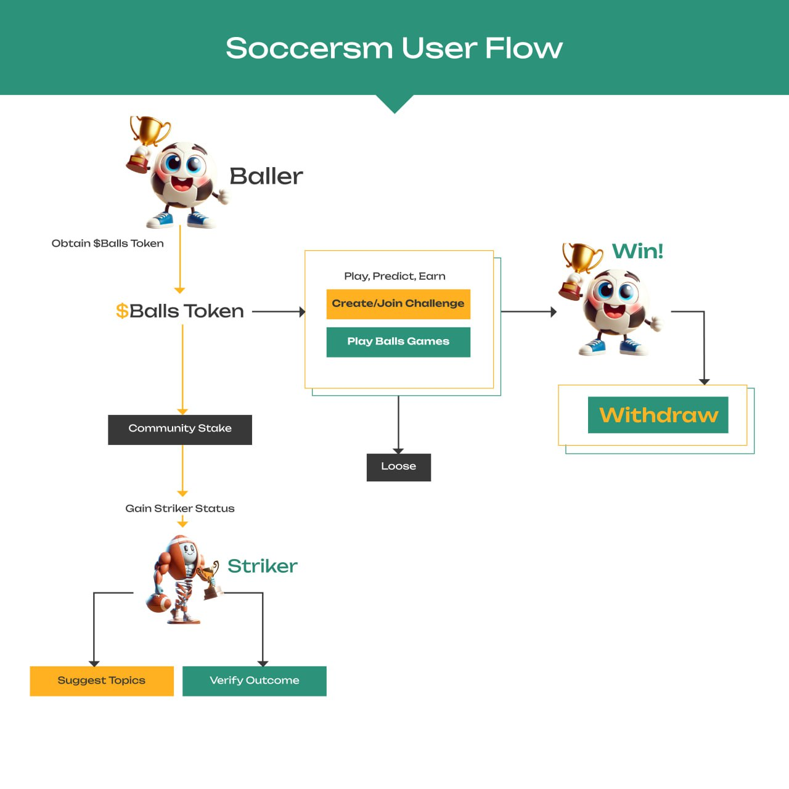
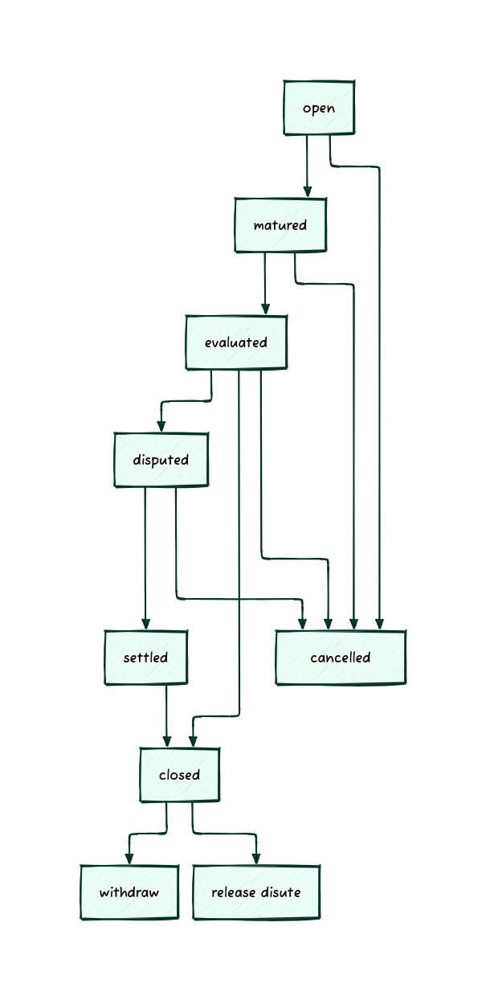
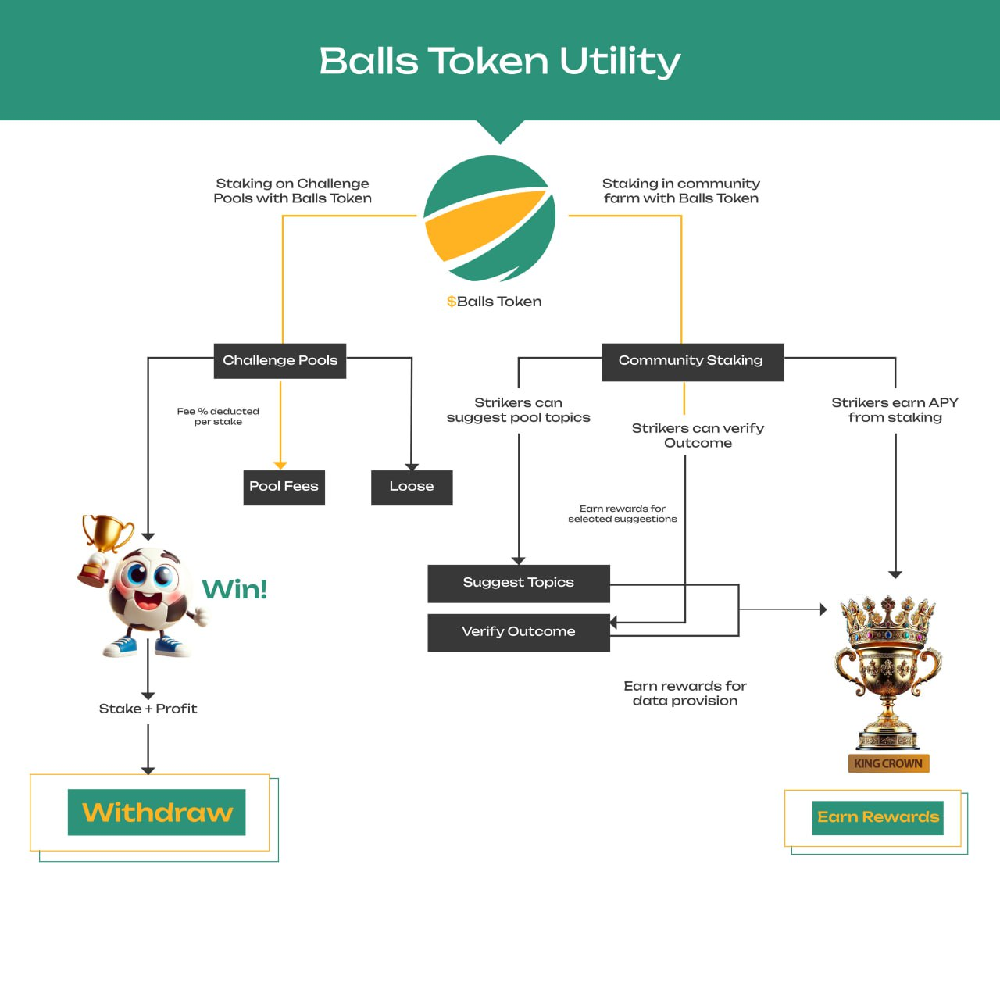

# challenge-pool-contracts

Soccersm prediction markets are called challenge pools, since players are challenging each other in a peer-to-peer manner faciliated by smart contracts.
This repo holds the code for soccersm challenge pool smart contracts. Contracts are implemented using the diamond pattern (<https://eips.ethereum.org/EIPS/eip-2535>, <https://github.com/mudgen/awesome-diamonds>) and good old hardhat for framework. Access control library from <https://github.com/solidstate-network/solidstate-solidity>.

# Core Components Diagram

## Quickstart

1. `bun install` to  install dependencies
2. `bun run deploys` to see a list of deployment ids
3. `bun run deploys:id <id>` to see all contract addresses for that id
4. Example `bun run deploys:id chain-4202` will list contract addresses deployed to the lisk testnet.

## Concepts

A prediction market is in essence a fill in the blank question, where the answer can be certain in the future. Anyone giving an answer now would only be guessing. A challenge pool allows people to stake on their guess. In the end, when the event finally occurs and the answer is certain, those with the right answers win the pool.

The process can be split into three distinct sections.

1. Generating questions for the market.
2. Facilitating market trading activities.
3. Evaluate winners and distribute rewards.

### Generating Questions for the Market

As stated in the intro, prediction market is like filling the blanks with money on it. In essence, there's a future variable we are trying to predict by allowing people to take a guess with a stake on it. Each guess is a possible rendition of the future.

On Soccersm, these questions can be generated 3 main ways;

1. Users on the platform can generate questions and start their own prediction market easily.
2. Questions generated by the Soccersm team.
3. AI generated questions.

### Facilitating market trading activities

This section involves providing correct interfaces for users to easily express themselves on the market. Another important thing to consider is pricing model to be used on the platform. This helps easily determine how much to charge for a position at any point in time.

#### Pricing Model

This is important to ensure a fair market. A simple implementation would use a fixed price, but that would mean lots of market dynamics can't take place. It is unfair especially for those that join the market earlier. Those who join later will have substantial information from the market and other sources which will influence them to make a better choice. This information they would have is in two forms;

1. Market probabilities
2. Time revealled information

Suppose a simple yes/no challenge has 90% / 10% probability after the market has been active for some time, then new participants would simply join the one with higher probability and pay the same as those who joined earlier. It should be more expensive to join the side with higher probability.
Aside obvious market probabilities, there's lots of information hidden in time. As such, those who join later should pay more. Hence a pricing model that takes into account the market probabilities and time is ideal.

#### Evaluate Winners & Distribute Rewards

Once the market deadline is over, the market would have to be evaluated and rewards distributed to the winners. The process of evaluating the market makes use of a blend of centralized & optimistic oracle approach. Soccersm maintains a centralized oracle that provides the outcomes of challenges once they happen in the real world.

This is done automatically or manually by the Soccersm team depending on the kind of market in question. If an API exists which can be reliably used to provide the outcome of the market, then the whole process is automated, otherwise it is done manually. The optimistic aspect leaves a dispute period that allows anyone to dispute the provided outcome.

Once outcome is finalized, the pool is closed an participants can withdraw their rewards. Rewards are not automatically sent to wallets, instead they have to be manually withdrawn.

## Architecture Summary

This features a collection of contracts and offchain backend applications that work to ensure users have a smooth challenge staking experience.

1. Challenge pool contract - logic to handle create/join challenge pools as well as withdraw winnings.
2. Pool Resolver contract - handles resolution of challenge
3. Data Provider contract - handles provision of resolution data after events happens in the real world.
4. Oracles - handles sending result of events to the data provider contract. automated if there is an api to get the event data in the real world. if no api exists then manual/crowd sourcing.

### Challenge Pool Contract

- Purpose: The core logic for managing challenge pools.
- Key Responsibilities:
  - Create Pools: Allows users to set up new challenge pools by defining event details, staking rules, and participation limits.
  - Join Pools: Enables users to participate in existing pools by staking their assets.
  - Withdraw Winnings: Facilitates the distribution of rewards to winners based on the event's outcome. Players can withdraw early at current market price of their positon.

### Data Provider Contract

- Purpose: Supplies real-world event outcomes to the blockchain.
- Key Responsibilities:
  - Aggregates event data from Oracles.
  - Validates incoming data for consistency and accuracy.
  - Acts as the intermediary between off-chain oracles and on-chain resolvers.
- Data Handling:
  - Stores event results for resolution.
  - Implements redundancy checks to prevent tampering or misinformation.
  - Has a dispute period to allow users to raise disputes if any.

### Pool Resolver Contract

- Purpose: Responsible for resolving the outcomes of events and pools.
- Key Responsibilities:
  - Accepts verified event resolution data from the Data Provider Contract.
  - Applies resolution logic to determine winners based on pool parameters.
  - Updates the status of challenge pools (e.g., resolved or disputed).

### Oracles

- Purpose: Connects real-world events with the blockchain.
- Key Responsibilities:
  - Automated Input: Fetches event outcomes through APIs for supported events (e.g., sports matches, elections).
  - Crowd sourced Input (DAO): Uses trusted individuals or community voting mechanisms for events without available APIs.
  - Soccersm council: This method allows the core soccersm team to resolve the dispute.
- Security and Redundancy:
  - Aggregates data from multiple sources.
  - Incorporates fallback mechanisms to mitigate single points of failure.

## Flows

### User Flow

This describes the journey of the user on the platform.

### Process Flow

### Access Control

Within the protocol there are the following access control roles

1. `DEFAULT_ADMIN_ROLE:` Probably same as diamond contract owner. can manage other roles.
2. `ORACLE_ROLE:` Oracle account that is allowed to provide data onchain.
3. `SOCCERSM_COUNCIL:` Soccersm council account steps in to resolve dispute and incorrect oracle data provided.
4. `CHALLENGE_POOL_MANAGER:` Manages challenge pool.
5. `TOPIC_REGISTRAR`: Manages topic registrations.

# Balls Token & Utility
The platform will be powered by the balls token.This depict the current utility. All features added in the future will utilize the $Balls token.

